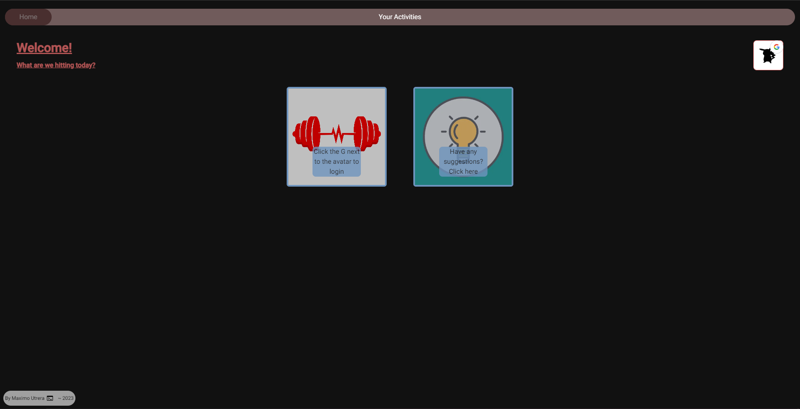
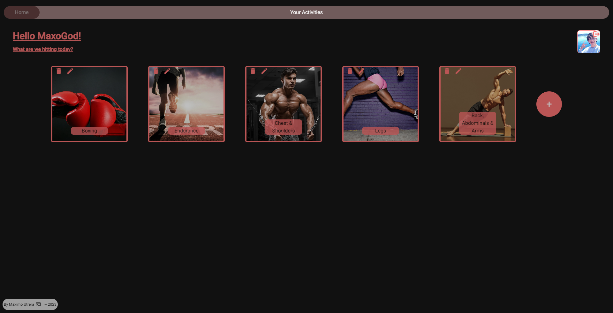
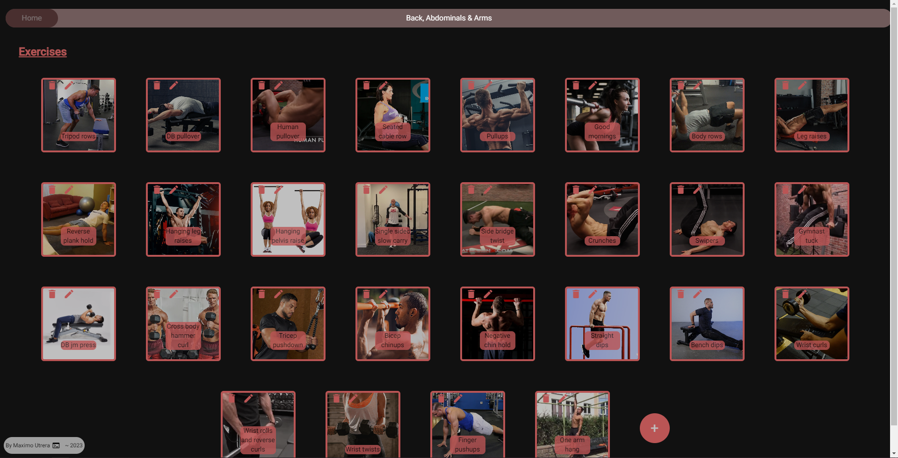
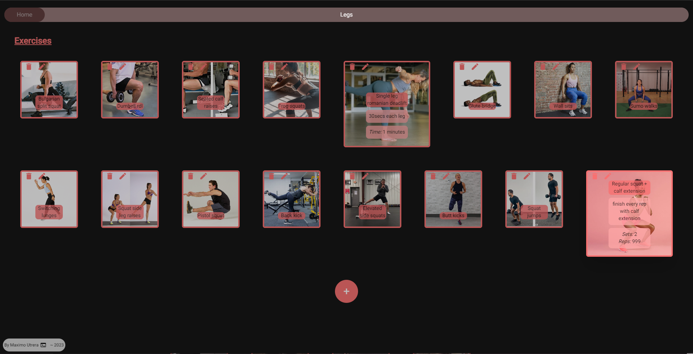
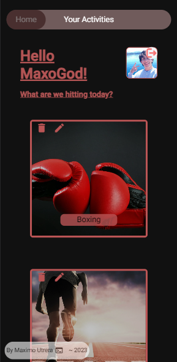
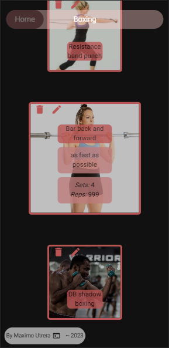
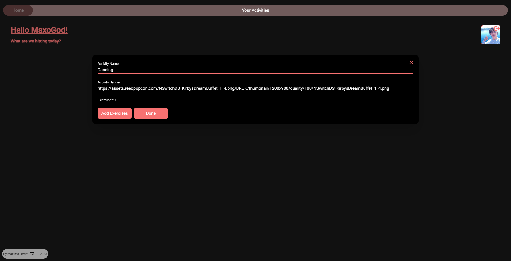
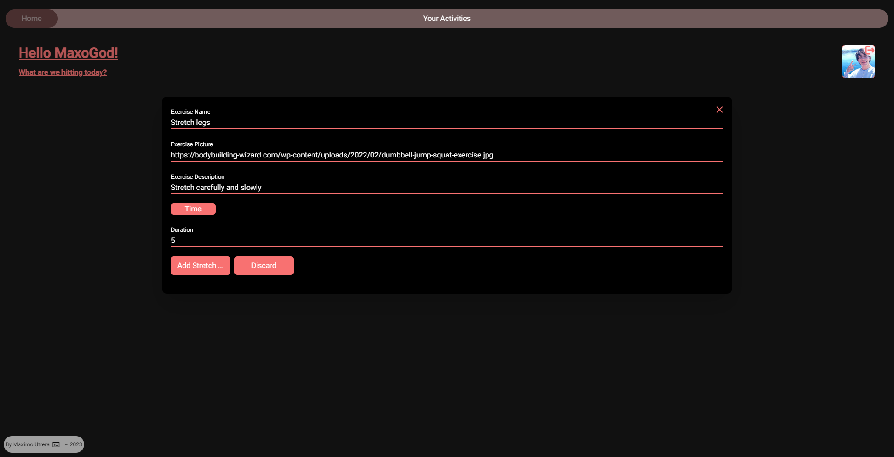

# Front-end for the [Gymchad](https://gymchad.onrender.com/) website

~ Website to organize different fitness activities such as dancing/leg day/boxing and the exercises that belong to that activity, including images of the exercise, a brief description or annotation, sets/reps or duration time.

~ For people like me, who always forget what good exercises they can do for each different activity (or muscle group), and want a more **aethetic** visual representation of them instead of writing them all on paper or something boring like that.

~ **Important: Website is hosted on [render.com](https://render.com/) free tier, so it spins down when nobody's using it and spins back up when a user enters the page but it takes a few minutes to see the page if you are that user.**

## Gymchad Tour ;)

* ### Unlogged welcome page

* ### Home page

* ### Activity page

* ### Exercise detailed view

* ### Mobile view

* ### Activity creation form

* ### Exercise creation form

Thanks for checking out my little personal project!
